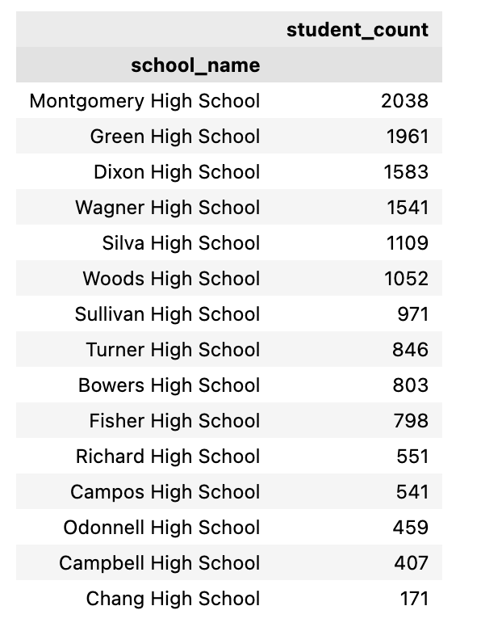

# School_District_Analysis

## Overview

A school district asked for help analyzing standardized testing data for the schools, both public and charter, within their school district. Access was given to testing scores for reading and math, as well as various information on the schools within the district. All the data will be aggregated and prepared to showcase trends in school performance. 

## Analysis

From running data analysis of charter schools and public schools within the school district, we were able to look at the amount of students at each school, compare the average budget of public and charter schools, and compare the standarized math test scores by grade from both public and charter schools. 

### Breakdown of Students per School

From the data given it can be concluded that Montgomery High School has the most amount of students, while Chang High School has the least. Both schools are public schools, while Richard High School, the only charter school in the district, has 551 students. 

### School Type versus School Budget

With the budget information given for each school, we were able to analyze and provide a breakdown of the average school budget by school type. From the data given, we can conclude that public schools have a higher budget than charter schools. 

### Math Scores Breakdown

From the data given, it can be concluded that on average charter school students scored higher on the math portion of the standardized test with the exception of the 12th graders. Public school 12th graders scored on average 3 points higher than 12th grade students at the charter school. 

## Summary

### Overview

Overall, from our analysis we were able to conclude that while public schools have on average a higher budget, they also tend to have more students compared to the charter school in the district. It was also concluded from looking at standardized test scores that charter school students from 9th to 11th grade scored higher on average than their public school counterparts. 

#### For Further Consideration

In order to have a better comparison of the schools within the district, I would suggest running an analysis comparing allocation of funds from the school budget, to see how the spending of the program component compares across the board. I would also suggest gathering data on the type of classes and programs offered at the schools in the district, and comparing the classes and program offerings as well as test scores. 
